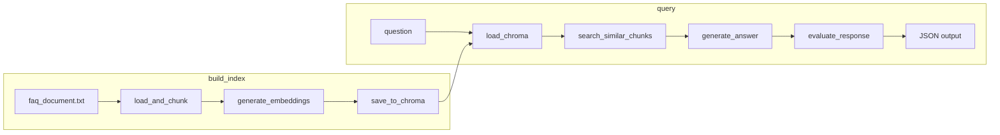

# Plan de implementación: FAQ Chatbot RAG para HR SaaS

## Estado actual

- Repositorio con `.gitignore` (excluye `.env`, `__pycache__/`, `chroma_db/`) y README.md mínimo.
- No existen aún: `data/`, `src/`, `outputs/`, ni los archivos del stack.

## Estructura objetivo

```
faq-rag-chatbot/
├── data/faq_document.txt
├── src/build_index.py
├── src/query.py
├── outputs/sample_queries.json
├── .env.example
├── requirements.txt
└── README.md
```

---

## 1. data/faq_document.txt COMPLETADA

**Objetivo:** Documento único en español, ≥1000 palabras, que al chunkearse produzca ≥20 chunks de 50–500 tokens.

**Contenido a generar (por secciones):**

- **Onboarding:** pasos del proceso, checklist, plazos, responsable, documentos necesarios, primer día.
- **Vacaciones y PTO:** política de días, solicitud, aprobación, acumulación, límites por año, compensación no tomados.
- **Nómina:** frecuencia (mensual/quincenal), fechas de pago, componentes (base, bonos, deducciones), acceso a recibos, impuestos.
- **Permisos:** tipos (médico, personal, estudio), cómo solicitarlos, plazos de aviso, documentación.
- **Roles del sistema:** administrador, RRHH, manager, empleado; permisos por rol; asignación y cambios.
- **Contraseñas y acceso:** política de contraseñas, recuperación, 2FA, expiración, primer acceso.
- **Reportes:** reportes disponibles (asistencia, nómina, headcount), quién puede solicitarlos, exportación (Excel/PDF), frecuencia.
- **Integraciones:** con qué sistemas se integra (ERP, reloj, correo), SSO, APIs disponibles.

Cada sección debe tener 2–4 párrafos claros (120–200 palabras por tema) para alcanzar ≥1000 palabras y asegurar chunks significativos.

**Validación post-chunking:** en `load_and_chunk_document` se validará que haya ≥20 chunks y que cada chunk esté en rango 50–500 tokens (estimación por palabras × ~1.3 o usando tiktoken/contador simple).

---

## 2. src/build_index.py COMPLETADA

**Dependencias:** openai, chromadb, numpy, python-dotenv; carga de `.env` al inicio del módulo.

| #   | Función                                                     | Entrada            | Salida            | Lógica                                                                                                                                                                                                      |
| --- | ----------------------------------------------------------- | ------------------ | ----------------- | ----------------------------------------------------------------------------------------------------------------------------------------------------------------------------------------------------------- |
| 1   | `load_and_chunk_document(path, chunk_size=300, overlap=50)` | path: str          | list[str]         | Abrir con encoding UTF-8, leer texto; dividir por palabras en ventanas de chunk_size con overlap; validar ≥20 chunks y cada chunk 50–500 tokens (fallar con mensaje claro si no); retornar lista de chunks. |
| 2   | `generate_embeddings(chunks)`                               | chunks: list[str]  | list[list[float]] | Por cada chunk, llamar OpenAI text-embedding-3-small; API key con os.getenv("OPENAI_API_KEY"); manejar errores de API/red; retornar lista de vectores.                                                      |
| 3   | `save_to_chroma(chunks, embeddings)`                        | chunks, embeddings | None              | Crear/persistir ChromaDB en ruta local (ej. ./chroma_db); colección "faq"; añadir documentos (chunks) e embeddings; IDs únicos (ej. chunk_0, chunk_1, ...).                                                 |
| 4   | `main()`                                                    | —                  | —                 | Definir path por defecto al documento (ej. data/faq_document.txt); llamar 1 → 2 → 3; imprimir resumen: nº chunks, dimensión del embedding, ruta de ChromaDB.                                                |

**Reglas:** cada función ≤30 líneas; manejo de errores en cada una (archivo no encontrado, API key ausente, error de ChromaDB); ejecución directa con `python -m src.build_index` (path del documento configurable por argumento o constante).
Defaults de chunking en `src/constants.py`: `CHUNK_SIZE_DEFAULT` y `CHUNK_OVERLAP_DEFAULT` (los flags de CLI sólo sobreescriben).

---

## 3. src/query.py COMPLETA

**Dependencias:** openai, chromadb, python-dotenv; carga de `.env` al inicio.

| #   | Función                                                | Entrada                               | Salida     | Lógica                                                                                                                                                                                                                                                                                                                                                                                                                      |
| --- | ------------------------------------------------------ | ------------------------------------- | ---------- | --------------------------------------------------------------------------------------------------------------------------------------------------------------------------------------------------------------------------------------------------------------------------------------------------------------------------------------------------------------------------------------------------------------------------- |
| 1   | `load_chroma_collection()`                             | —                                     | Collection | Conectar a la base ChromaDB existente (misma ruta que en build_index); devolver colección "faq"; manejar error si no existe.                                                                                                                                                                                                                                                                                                |
| 2   | `search_similar_chunks(question, collection, top_k=3)` | question: str, collection, top_k: int | list[dict] | Embedear question con text-embedding-3-small; búsqueda por similitud coseno en Chroma (query_embeddings + top_k); retornar 2–5 chunks (restringir/validar top_k en 2–5). **Cada ítem retornado debe ser un dict con exactamente "text" (str) y "score" (float, similitud coseno); nunca retornar solo strings.**                                                                                                            |
| 3   | `generate_answer(question, chunks)`                    | question: str, chunks: list[dict]     | str        | Construir prompt: contexto = concatenación de los textos de chunks; instrucción de responder solo con el contexto y citar; llamar gpt-4o-mini; devolver respuesta en texto.                                                                                                                                                                                                                                                 |
| 4   | `evaluate_response(question, answer, chunks)`          | question, answer, chunks              | dict       | Prompt a gpt-4o-mini para evaluar: relevancia, completitud, fidelidad al contexto; respuesta estructurada: `{"score": int 0-10, "reason": str}` con reason ≥50 caracteres.                                                                                                                                                                                                                                                  |
| 5   | `main(question)`                                       | question: str                         | dict       | Orquestar: cargar colección → buscar chunks → generar respuesta → evaluar. **Retornar siempre** un JSON con exactamente estas claves: `{"user_question": str, "system_answer": str, "chunks_related": [{"text": str, "score": float}], "evaluation": {"score": int, "reason": str}}`. No es opcional: `chunks_related` es la lista de dicts con "text" y "score" de los chunks usados; `evaluation` debe incluirse siempre. |

**Formato de retorno de `main(question)` (obligatorio):**

```json
{
  "user_question": str,
  "system_answer": str,
  "chunks_related": [{"text": str, "score": float}],
  "evaluation": {"score": int, "reason": str}
}
```

**Reglas:** cada función ≤30 líneas; API key solo con `os.getenv("OPENAI_API_KEY")`; manejo de errores en cada función.

**CLI:** ejecutable con `python src/query.py --question "tu pregunta"` (usar argparse); imprimir el JSON de retorno de `main(question)`.

**Logging y resiliencia (implementado):** En `src/query.py` se configura un logger por módulo (StreamHandler, formato con timestamp y nivel). En `generate_answer` y `evaluate_response` se mide el tiempo de cada llamada al LLM y se registra con `logger.info`; en el `except` se usa `logger.error` antes de relanzar. La llamada real a la API está en `src/utils/llm_adapter.py` (método `OpenAILLMProvider.chat`), donde se añadió timeout de 30 s, medición de tiempo y logging de éxito/error, de modo que si falla el LLM la app no se cae sin traza.

---

## 4. outputs/sample_queries.json COMPLETA

**Formato:** JSON con una clave (ej. `"queries"` o `"sample_queries"`) que sea un array de 3 objetos. Cada objeto debe tener el mismo formato que devuelve `main(question)` en src/query.py: `{"user_question", "system_answer", "chunks_related", "evaluation"}`.

**Importante:** Las 3 respuestas deben ser **reales** (generadas ejecutando el sistema con `build_index.py` y `query.py`), **no placeholders**. Este archivo se genera **después** de haber ejecutado `build_index.py` (para crear el índice) y de ejecutar `query.py` con las tres preguntas de ejemplo; volcar el resultado de cada ejecución en el array del JSON.

Ejemplos de preguntas (3):

1. **Onboarding:** "¿Qué pasos debo seguir en mi proceso de onboarding y qué documentos necesito?"
2. **Vacaciones/nómina:** "¿Cuántos días de vacaciones tengo al año y cómo solicito el pago de nómina?"
3. **Roles e integraciones:** "¿Qué roles existen en el sistema y con qué aplicaciones se integra la plataforma?"

---

## 5. requirements.txt COMPLETA

Versiones fijas (compatibles con Python 3.11):

```
openai==1.54.3
chromadb==0.5.23
numpy==1.26.4
python-dotenv==1.0.1
```

Alternativa si se prefiere stack más reciente (verificar compatibilidad ChromaDB/OpenAI):

```
openai>=1.54.0,<2
chromadb>=0.5.0,<0.6
numpy>=1.26.0,<3
python-dotenv>=1.0.0,<2
```

En el plan se recomienda usar versiones fijas exactas (primera opción) para reproducibilidad.

---

## 6. .env.example COMPLETA

Contenido:

```
OPENAI_API_KEY=sk-your-key-here
```

Sin valores reales; comentario opcional de una línea indicando que se copie a `.env` y se rellene la clave.

---

## 7. README.md COMPLETA

**Secciones:**

- **Descripción:** FAQ Chatbot RAG para HR SaaS: índice de preguntas frecuentes en español, búsqueda por similitud y respuestas generadas con GPT-4o-mini usando el contexto recuperado.
- **Requisitos:** Python 3.11, cuenta OpenAI con API key.
- **Instalación:** `pip install -r requirements.txt`, copiar `.env.example` a `.env`, configurar `OPENAI_API_KEY`.
- **Uso:**
  - Construir índice: `python -m src.build_index` (opcional: argumento con path del documento).
  - Consultar: `python src/query.py --question "tu pregunta"`.
- **Decisiones técnicas** (1–2 oraciones cada una):
  - Chunking: ventana por palabras con overlap para no cortar frases y mantener contexto; tamaño 300 palabras y overlap 50 para equilibrar granularidad y coherencia.
  - Búsqueda: similitud coseno sobre embeddings en ChromaDB (text-embedding-3-small) para recuperar los chunks más relevantes antes de generar la respuesta con el LLM.
- Opcional: breve mención de la evaluación de respuestas (score 0–10 y reason) si se expone en la salida o en sample_queries.

---

## 8. Flujo de datos (resumen) COMPLETA



---

## 9. Orden de implementación sugerido

1. **requirements.txt** y **.env.example** — sin dependencias de código.
2. **data/faq_document.txt** — redactar las 8 secciones (≥1000 palabras) para cumplir ≥20 chunks.
3. **src/build_index.py** — implementar las 4 funciones en orden; probar con el documento.
4. **src/query.py** — implementar las 5 funciones en orden; probar con una pregunta.
5. **outputs/sample_queries.json** — **generar después** de tener el índice y query funcionando: ejecutar 3 consultas con el CLI (`query.py`) y volcar el resultado real (no placeholders) en el JSON.
6. **README.md** — completar descripción, instalación, uso y decisiones técnicas.

---

## 10. Validaciones y criterios de aceptación

- **Chunking:** ≥20 chunks; cada chunk entre 50 y 500 tokens; encoding UTF-8.
- **Embeddings:** un vector por chunk con text-embedding-3-small.
- **ChromaDB:** colección "faq", persistencia local, IDs únicos.
- **Query:** salida JSON con exactamente `user_question`, `system_answer`, `chunks_related` (lista de `{"text", "score"}`), `evaluation` (siempre incluida).
- **search_similar_chunks:** cada elemento retornado es dict con "text" y "score" (similitud coseno).
- **Evaluación:** `evaluate_response` devuelve `{"score": int 0-10, "reason": str}` con `len(reason) >= 50`.
- **CLI:** `python -m src.build_index` y `python src/query.py --question "..."` funcionando.
- **Código:** funciones ≤30 líneas, API key solo por `os.getenv`, manejo de errores en cada función.
- **sample_queries.json:** las 3 entradas son respuestas reales del sistema, generadas tras ejecutar build_index y query.

## 11. Refactors y calidad de código

- **Evaluar refactors posibles:** desacoplamiento (constantes, config, prompts en JSON, utils), reutilización de código entre build_index y query (cliente OpenAI, cliente Chroma, generación de embeddings), y aplicación de buenas prácticas (clean code, SOLID donde aplique)."”

## 12. Logging y manejo de excepciones en llamadas LLM (COMPLETADA)

**Objetivo:** Evitar que un fallo del LLM derribe la aplicación sin traza y permitir observar tiempos de respuesta.

**Implementado:**

| Ubicación                    | Qué se hace                                                                                                                                                                                                                                  |
| ---------------------------- | -------------------------------------------------------------------------------------------------------------------------------------------------------------------------------------------------------------------------------------------- |
| **src/utils/llm_adapter.py** | Logger a nivel de módulo. En `OpenAILLMProvider.chat()`: `try` con `time.time()` antes de `client.chat.completions.create(..., timeout=30)`, log de duración con `logger.info`, `except` con `logger.error` y `raise`.                       |
| **src/query.py**             | Logger a nivel de módulo. En `generate_answer` y `evaluate_response`: medición de tiempo alrededor de `get_llm_provider().chat(...)`, `logger.info` con tiempo transcurrido, `logger.error` en el `except` antes de relanzar `RuntimeError`. |

**Reglas:** La configuración del logger (handler, formatter) se hace una vez por módulo; el bloque try/except y la medición de tiempo van dentro de las funciones que llaman al LLM.
