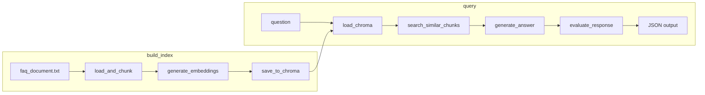

# Flujo de datos (resumen)

Resumen del flujo de datos del FAQ Chatbot RAG: desde la construcción del índice hasta la consulta y evaluación de respuestas.

---

## Diagrama

---

## Fases

| Fase | Descripción |
|------|-------------|
| **build_index** | Lee `data/faq_document.txt`, lo divide en chunks, genera embeddings con OpenAI y persiste todo en ChromaDB (colección `faq`). |
| **query** | Carga la colección ChromaDB, recibe una pregunta, busca chunks similares, genera la respuesta con el LLM y la evalúa; devuelve un JSON con pregunta, respuesta, chunks usados y evaluación. |

El enlace `D --> F` indica que la salida de ChromaDB (índice persistido) es la entrada del flujo de consulta al cargar la colección.
